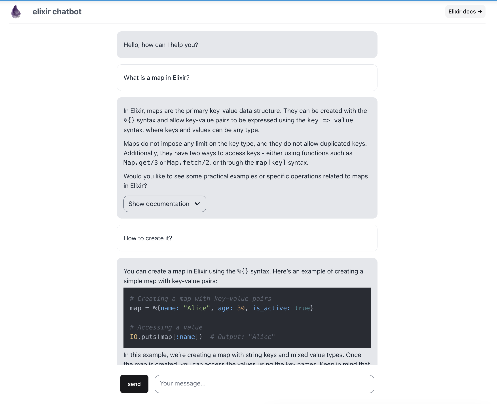
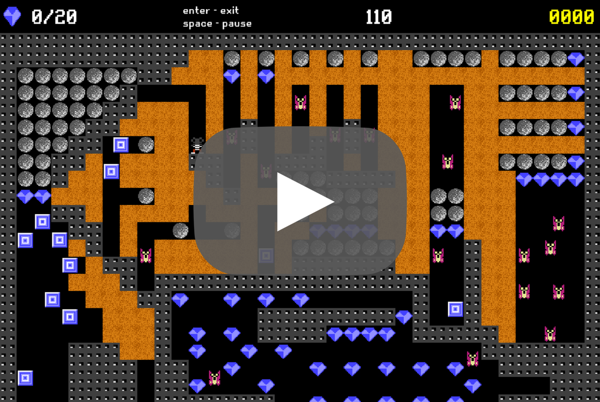

### Hello there!
I'm a Software Engineer at Ocado Technology and a recent Computer Science graduate. I'm truly fascinated by mathematics, algorithms and machine learning. I code mainly in C, C++, Java, Python and Elixir.

# [Elixir Chatbot](https://github.com/sgol13/elixir-chatbot)

My thesis project - a chatbot answering questions about the Elixir programming language. 
- The project’s client was Jose Valim, creator of the Elixir.
- According to the benchmark, it significantly outperforms ChatGPT within its narrow domain.
- We built a flexible framework to enable testing the variety of generative and embedding models.

 
 

# [Boulder Dash](https://github.com/sgol13/boulder-dash)

A clone of Boulder Dash in C++, which I created for fun and learning. It contains visible improvements compared to the original version: fluent movement of objects and the possibility of two objects to partly cover the same field.

